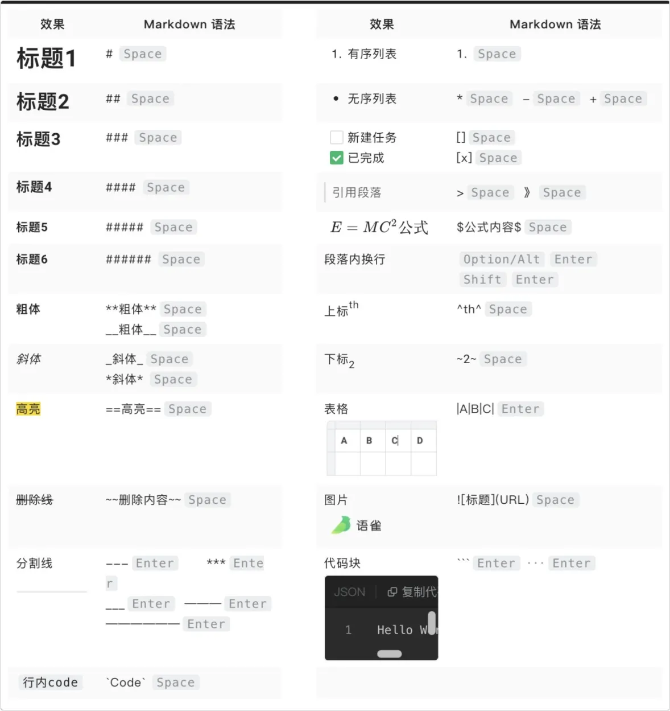

## 标题

\#一级标题

 \##二级标题 

\###三级标题

\####四级标题

\#####五级标题 

\######六级标题

（注意加空格！！！）

------

## 字体

_ 斜体文本_        // * 斜体文本*  

__ 粗体文本__      // ** 粗体文本** 

___ 粗斜体文本___ //  *** 粗斜体文本***

+space

------

## 分隔线

使用三个或以上的*、-、_来建立分隔线，其中可以插入空格.   
eg:   _ _ _ --- *** + enter

------

## 下划线与删除线

文字两端加上标签是下划线，加上两个波浪线 ~~则是删除线~~。

<u>下划线不支持</u>

------

## 高亮

==sentence== 

sentence

### 脚注

\\^th^

这是一段内容内容

 :这是脚注！！！

[Markdown官方教程](https://markdown.com.cn/basic-syntax/)
